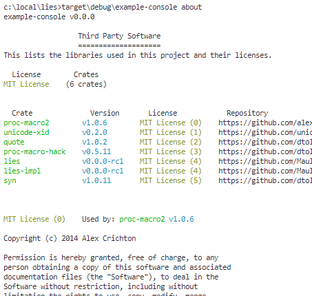

# lies

**LIES** - **LI**cense **E**mbedding **S**ystem

[](https://github.com/MaulingMonkey/lies)
[](https://travis-ci.org/MaulingMonkey/lies)
[](https://crates.io/crates/lies)


[](https://github.com/MaulingMonkey/lies/issues)
[](https://github.com/MaulingMonkey/lies)
[](https://docs.rs/lies/)
<!--[](https://deps.rs/repo/github/MaulingMonkey/lies)-->

Wraps and reformats the results of [cargo-about] to embed license text and information
inside your console program, as a means of complying with licensing requirements.

# Examples

## Quick Start

```rust
println!("{}", lies::licenses_text!()); // Monochrome
println!("{}", lies::licenses_ansi!()); // https://en.wikipedia.org/wiki/ANSI_escape_code
```

## [example-console](crates/example-console)

### Screenshots



### Text Dump

```
c:\local\lies>target\debug\example-console about 
example-console v0.0.0

                  Third Party Software
                  ====================
This lists the libraries used in this project and their licenses.

  License        Crates
MIT License    (6 crates)


  Crate              Version       License            Repository
proc-macro2        v1.0.6        MIT License (0)    https://github.com/alexcrichton/proc-macro2
unicode-xid        v0.2.0        MIT License (1)    https://github.com/unicode-rs/unicode-xid  
quote              v1.0.2        MIT License (2)    https://github.com/dtolnay/quote
proc-macro-hack    v0.5.11       MIT License (3)    https://github.com/dtolnay/proc-macro-hack 
lies               v0.0.0-rc1    MIT License (4)    https://github.com/MaulingMonkey/lies      
lies-impl          v0.0.0-rc1    MIT License (4)    https://github.com/MaulingMonkey/lies      
syn                v1.0.11       MIT License (5)    https://github.com/dtolnay/syn


MIT License (0)    Used by: proc-macro2 v1.0.6

Copyright (c) 2014 Alex Crichton

Permission is hereby granted, free of charge, to any
person obtaining a copy of this software and associated
documentation files (the "Software"), to deal in the
Software without restriction, including without
[...]
```

## License

Licensed under either of

* Apache License, Version 2.0 ([LICENSE-APACHE](LICENSE-APACHE) or http://www.apache.org/licenses/LICENSE-2.0)
* MIT license ([LICENSE-MIT](LICENSE-MIT) or http://opensource.org/licenses/MIT)

at your option.

## Contribution

Unless you explicitly state otherwise, any contribution intentionally submitted
for inclusion in the work by you, as defined in the Apache-2.0 license, shall be
dual licensed as above, without any additional terms or conditions.

<!-- https://doc.rust-lang.org/1.4.0/complement-project-faq.html#why-dual-mit/asl2-license? -->
<!-- https://rust-lang-nursery.github.io/api-guidelines/necessities.html#crate-and-its-dependencies-have-a-permissive-license-c-permissive -->
<!-- https://choosealicense.com/licenses/apache-2.0/ -->
<!-- https://choosealicense.com/licenses/mit/ -->

[cargo-about]:              https://github.com/EmbarkStudios/cargo-about/
